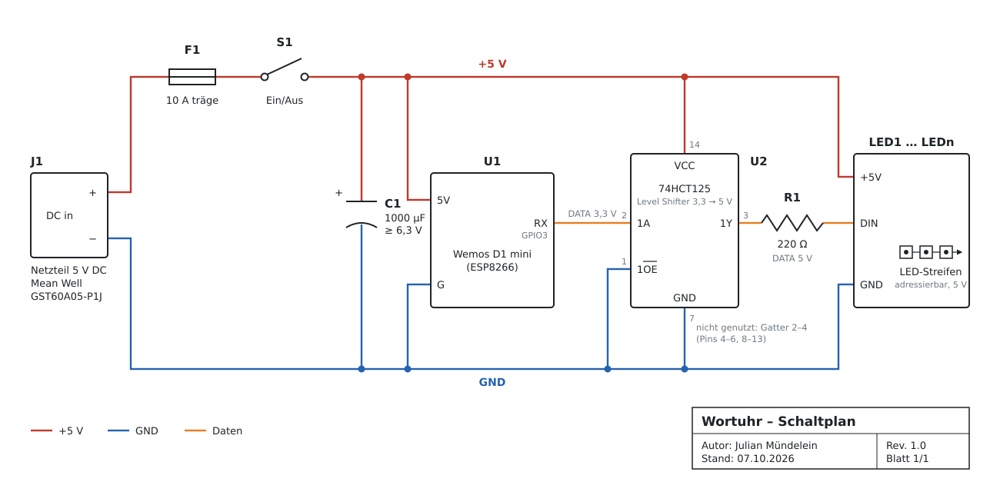

# Wordclock

An independently built word clock, documented as a record of my own project.

This repository brings together the files and notes from my Wortuhr build: electronics, 3D-print files, firmware, photos, and project documentation. It describes what I built and the choices I made along the way; it is not intended to be a step-by-step assembly guide.

> **Project details in progress:** Hardware, software, dimensions, and build history will be added as they are documented. See the [build report](BUILD_REPORT.md) for the current notes and TODOs.

## At a glance

- **Controller:** Wemos D1 mini (ESP8266)
- **Lighting:** addressable 5 V LED strip, driven from `RX`/GPIO3 via a 74HCT125 level shifter
- **Power:** Mean Well GST60A05-P1J, 5 V
- **Front:** stainless-steel panel ([DXF](fabrication/stainless-front-panel/))
- **Firmware:** [OpenWordClock-Software](https://github.com/openclock/OpenWordClock-Software)

## Repository contents

| Folder or file | Contents |
| --- | --- |
| [`electronics/schematic/`](electronics/schematic/) | Schematic (SVG/PNG), original sketch, bill of materials, wiring |
| [`electronics/pcb/`](electronics/pcb/) | PCB design files and related notes |
| [`3d-print/deckplate/`](3d-print/deckplate/) | Deckplate file(s); source and permission details are still to be documented |
| [`3d-print/enclosure/`](3d-print/enclosure/) | Enclosure and housing files |
| [`3d-print/other-parts/`](3d-print/other-parts/) | Other 3D-printed parts, including `komplette_Grundplatte_.stl` |
| [`fabrication/stainless-front-panel/`](fabrication/stainless-front-panel/) | `EdelstahlFrontV6.dxf`, the stainless-front-panel drawing |
| [`firmware/`](firmware/) | Firmware source reference and hardware-relevant settings |
| [`photos/build/`](photos/build/) | Photos from the build process |
| [`photos/finished/`](photos/finished/) | Photos of the completed clock |
| [`docs/`](docs/) | Supporting project notes |
| [`BUILD_REPORT.md`](BUILD_REPORT.md) | Personal project report and build notes |

Some folders are currently empty and are included to establish a place for project files as they are added.

## Licensing

**TODO:** Choose and document a license for the original project files. No license has been selected yet. The origin and usage terms for any third-party files, including the deckplate, must be confirmed before describing or relicensing them. See [`LICENSE_TODO.md`](LICENSE_TODO.md).
