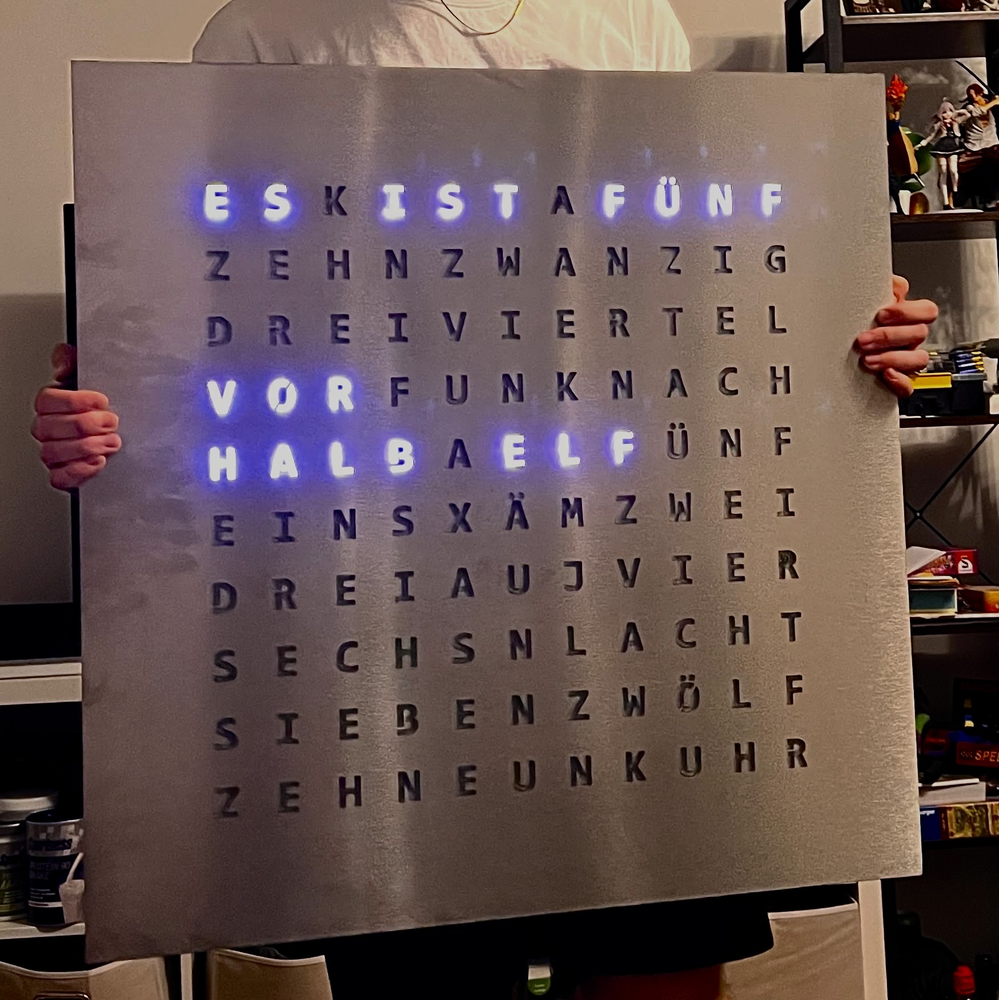
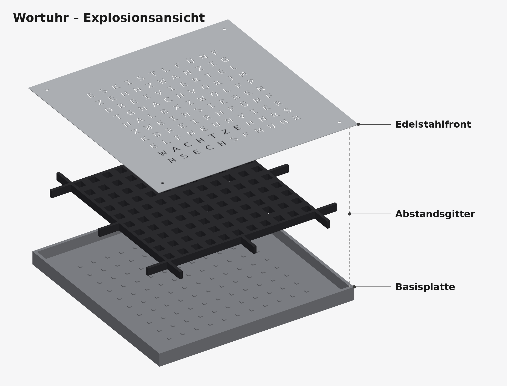

# Wordclock

My self-built word clock with a laser-cut stainless-steel front. In the photo it reads „ES IST FÜNF VOR HALB ELF“.

## Front panel

[`fabrication/stainless-front-panel/EdelstahlFrontV6.dxf`](fabrication/stainless-front-panel/)

Stainless-steel front, 697.5 × 697.5 mm, with a German 11 × 10 letter grid. I drew it in Fusion 360 and exported it as DXF for laser cutting.

## CAD assembly

[`cad/GesamtModell.step`](cad/GesamtModell.step)

STEP export of the full assembly from Fusion 360, with two parts:

- **Basisplatte**: base plate that holds the LED strips
- **Abstandsgitter**: spacer grid between the LEDs and the front, so each letter is lit separately

## Electronics

[`electronics/schematic/`](electronics/schematic/)

- **Controller:** Wemos D1 mini (ESP8266)
- **LEDs:** addressable 5 V LED strip
- **Level shifter:** 74HCT125 with a 220 Ω series resistor, data from `RX`/GPIO3
- **Power:** Mean Well GST60A05-P1J, 5 V

The folder also has the bill of materials, the wiring table and my original hand sketch.

## Firmware

[OpenWordClock-Software](https://github.com/openclock/OpenWordClock-Software), built with PlatformIO. The hardware-relevant settings are listed in [`firmware/`](firmware/).
